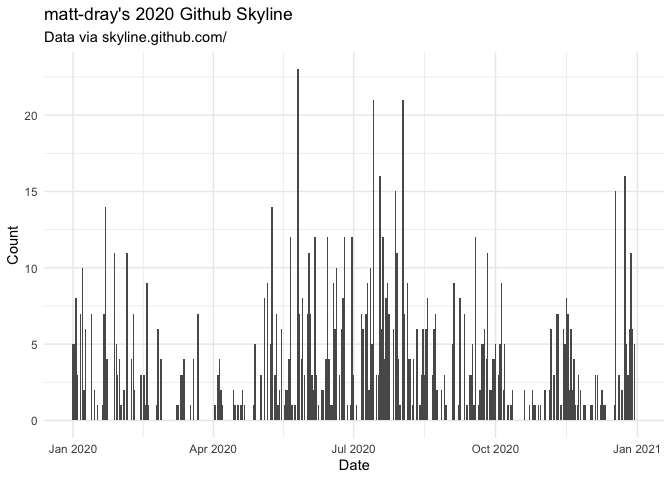
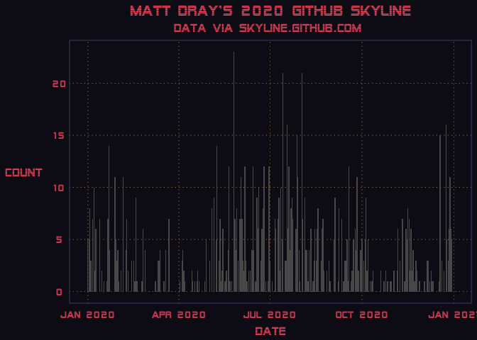

<!-- README.md is generated from README.Rmd. Please edit that file -->

# {skyphone}

<!-- badges: start -->

[](https://www.repostatus.org/#concept)
<!-- badges: end -->

The goal of {skyphone} is to create an audio version of a [GitHub
Skyline](https://skyline.github.com/) in R.

Skyline is a novelty webservice from GitHub. You input a username and
can ‘view a 3D model of your GitHub contribution graph.’ It looks a bit
like a city skyline, hence the name.

{skyphone} fetches the contributions data from the Skyline API and puts
it in a nice, tidy table that you can sonify (i.e. convert to an audio
signal) or plot.

Very much in development.

## Installation

You can install {skyphone} package from GitHub.

``` r
remotes::install_github("skyphone")
```

This assumes you’ve already installed {remotes} from CRAN with
`install.packages("remotes")`

## Examples

The `sky_get()` function fetches from the Skyline API a named user’s
(open) contributions for a given year. Here’s what it looks like to
fetch my own contributions for 2020:

``` r
library(skyphone)
md <- sky_get("matt-dray", 2020)
md
#> # A tibble: 366 x 6
#>    user       year  week   day date       count
#>    <chr>     <int> <int> <int> <date>     <int>
#>  1 matt-dray  2020     1     1 2020-01-01     5
#>  2 matt-dray  2020     1     2 2020-01-02     5
#>  3 matt-dray  2020     1     3 2020-01-03     8
#>  4 matt-dray  2020     1     4 2020-01-04     3
#>  5 matt-dray  2020     2     5 2020-01-05     0
#>  6 matt-dray  2020     2     6 2020-01-06     7
#>  7 matt-dray  2020     2     7 2020-01-07    10
#>  8 matt-dray  2020     2     8 2020-01-08     2
#>  9 matt-dray  2020     2     9 2020-01-09     6
#> 10 matt-dray  2020     2    10 2020-01-10     0
#> # … with 356 more rows
```

You can hear contributions over time by passing the output from
`sky_get()` to `sky_sonify()`. This function uses the {sonify} package
to convert the data to audio format, where peaks are higher pitched.

``` r
sky_sonify(md, play = FALSE, out_dir = NULL)
#> 
#> WaveMC Object
#>  Number of Samples:      220500
#>  Duration (seconds):     5
#>  Samplingrate (Hertz):   44100
#>  Number of channels:     2
#>  PCM (integer format):   TRUE
#>  Bit (8/16/24/32/64):    16
```

You’ll hear the output from your speakers if you set `play = TRUE`
and/or save the audio file as a .wav to the folder provided by
`out_dir`.

[🔈 Click here to listen to the sonified output from this
example.](https://www.rostrum.blog/output/skyphone/skyphone_matt-dray_2020.wav)

I’ve also included a simple, opinionated plotting function called
`sky_plot`, which gives you a 2D representation of your ‘skyline’.

``` r
p <- sky_plot(md)
p
```



There’s no reason why you couldn’t mimic the vaporwave aesthetic of
GitHub Skyline website using [the {vapoRwave}
package](https://github.com/moldach/vapoRwave)…

``` r
library(vapoRwave)  # install from GitHub
p + new_retro()
```



## Thanks

To GitHub, obviously. To [Matt
Kerlogue](https://www.github.com/mattkerlogue) for the nerdsnipe. To Den
Delimarsky for [writing about the Skyline
API](https://den.dev/blog/get-github-contributions-api/).

## GitHub terms

You can read GitHub’s
[terms](https://docs.github.com/en/github/site-policy/github-terms-of-service)
and [privacy
statement](https://docs.github.com/en/github/site-policy/github-privacy-statement)
for their service.

## Code of Conduct

Please note that the {skyphone} project is released with a [Contributor
Code of
Conduct](https://contributor-covenant.org/version/2/0/CODE_OF_CONDUCT.html).
By contributing to this project, you agree to abide by its terms.
